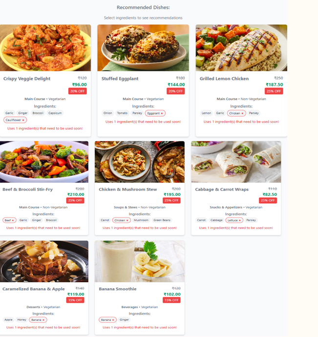

# 🍽️ Smart Inventory & Menu Management System

A cutting-edge AI-powered solution for **automated inventory management**, **real-time freshness tracking**, **intelligent menu recommendation**, **sales forecasting**, and **waste analysis**. Designed to help restaurants and food businesses maximize efficiency, minimize waste, and boost profitability.

---

## 👨‍💻 Team

**Team Name**:  
- Satwik Kishore  
- Neeharika Joshi  
- Sonu Pandit  
- Shubham Pandit  

**Institution**: Marwadi University

---

## 🚀 Features

### 📦 1. Automatic Inventory Management
- Upload an image of the inventory → System detects items & their quantities.
- Detects **freshness level** (fresh/spoiled) using visual inspection.
- Tracks freshness decay and triggers **spoilage warnings**.

> 🔍 **Model Used**:  
- `YOLOv8` for object & quantity detection (Accuracy: **98%**)  
- `MobileNet` for freshness classification (Accuracy: **85%**)

---

### 🧠 2. Smart Sales Prediction & Inventory Replenishment
- Predicts **future sales** using past data.
- Calculates required ingredients and triggers **buy suggestions**.
- Prevents overstocking and **reduces spoilage risk**.

> 🔍 **Model Used**:  
- `Facebook Prophet` (Accuracy: **89%**)  
- Dataset: Self-generated

---

### 🧾 3. AI-Driven Menu Optimization
- Recommends recipes based on ingredients **about to spoil**.
- Provides **customized menu** suggestions via checkboxes.
- Applies **smart discounts/offers** to boost sales and reduce waste.

> 🧠 Goal: Turn waste into opportunity by dynamically adjusting offerings!

---

### 🗑️ 4. Vision-Based Waste Management (In Progress)
- Waste detection from camera feeds.
- Identify causes of waste.
- Suggest operational and inventory-level improvements.

---

## 🛠️ Tech Stack

| Layer         | Tech Used                           |
|--------------|-------------------------------------|
| **Frontend** | React.js, Tailwind CSS              |
| **Backend**  | Python, FastAPI                     |
| **Database** | MySQL                               |
| **ML Models**| YOLOv8, MobileNet, Prophet          |
| **Libraries**| PyTorch, Keras                      |

---

## 🔍 Accuracy Metrics

| Task                     | Model     | Accuracy |
|--------------------------|-----------|----------|
| Item Detection           | YOLOv8    | 98%      |
| Freshness Classification | MobileNet | 85%      |
| Sales Forecasting        | Prophet   | 89%      |

---

### 📂 Dataset Sources

| Purpose | Dataset | Source |
|--------|---------|--------|
| **Freshness Detection (Fruits & Vegetables)** | Fruit and Vegetable Freshness Detection | [Kaggle](https://www.kaggle.com/datasets/redzone000/fruit-and-vegetable-freshness-detection) |
| **Visual Inventory Detection (Food Objects)** | Custom Food Detection Dataset | [Roboflow](https://universe.roboflow.com/food-elqho/detectionn-y2kce) |
| **Sales Forecasting, Ingredient Lifespan, Waste Prediction, and Menu Recommendations** | Self-generated dataset | Based on restaurant sales, ingredient usage, and spoilage patterns |

## 📸 Screenshots & Demo

📽️ **Video Demo**: [Watch on YouTube](https://youtu.be/OVhiC5TvqCk)

📥 **Export Options**: Downloadable CSV reports of predictions and inventory status.

⚠️ **Alerts**: Integrated spoilage alert system.

---

Great idea, Satwik! Let's add a clean, well-organized section called **📁 File Structure & Purpose** to explain what each file or folder in your project is used for. Here's how you can insert it into your README (right before or after the `📦 Installation & Requirements` section):

---

### 📁 File Structure & Purpose

| File/Folder                    | Purpose |
|-------------------------------|---------|
| `backend/`                    | Contains the FastAPI backend, ML model endpoints, and business logic |
| `backend/mainAPI.py`             | Main FastAPI application entry point |
| `backend/models/`             | Trained ML models like YOLOv8, MobileNet, and Prophet |
| `backend/Smart_Inventory/`              | For Predicting how much Ingridentes are needed for tommorow |
| `backend/Connect_MySQL/`             | To Connect to MySQL database |
| `backend/SQL_Action/`             | This contail all the action which include CRUD |
| `backend/UserActionSQL/`             | To Connect to MySQL database |
| `frontend/`                   | React.js + Tailwind frontend code for dashboard and user interaction |
| `frontend/src/components/`   | UI components such as item cards, charts, and modals |
| `frontend/src/pages/`        | Page layout components (Dashboard, Inventory View, etc.) |
| `Training.py`                 | This file contain code to train yolo model |
| `Test_All.py`                 | This is to test the yolo model on all the data by providing it path |
| `Test.py`                 | This is to test the yolo model on single image |
| `Sale_prediction.py`                 | This code is for sales prediciton |
| `DataSet_Spliter.py`                 | This code  |
| `.gitignore`                 | Lists files/folders Git should ignore (e.g., models, videos, logs) |
| `requirements.txt`           | Python dependencies for backend and ML |
| `README.md`                  | Project documentation |


---

You can adjust or expand this table depending on how your repo is structured. If you want, I can take a peek at the actual folder layout and auto-generate this for you too. Just let me know.

## 📦 Installation & Requirements

- ✅ Frontend setup  
- ✅ Backend setup  
- ✅ Database setup (export/import)

---

### 🛠️ Setup Guide

#### ✅ Prerequisites
Ensure you have the following installed:
- [Python 3.8+](https://www.python.org/downloads/)
- [Node.js v14+](https://nodejs.org/)
- [MySQL Server](https://dev.mysql.com/downloads/mysql/)
- [Git](https://git-scm.com/)

---

### 🔧 Backend Setup

```bash
git clone https://github.com/yourusername/smart-inventory.git
cd smart-inventory/backend
pip install -r requirements.txt
uvicorn main:app --reload
```

> This runs the FastAPI backend on `http://localhost:8000`. It powers all APIs for inventory detection, freshness tracking, smart recommendations, and more.

---

### 🎨 Frontend Setup

```bash
cd ../frontend
npm install
npm run dev
```

> Starts the React + Tailwind frontend on `http://localhost:3000`. The dashboard allows monitoring, visualization, and interaction with the AI engine.

---

### 🗃️ Database Setup

#### 📥 Importing the MySQL Database (if `.sql` file provided)

```bash
mysql -u root -p
CREATE DATABASE petpooja;
exit

mysql -u root -p petpooja < petpooja_dump.sql
```

> Replace `root` with your MySQL username if different.

#### 💾 Exporting (Dumping) the Database
If you need to back it up:

```bash
mysqldump -u root -p petpooja > petpooja_dump.sql
```

#### 📥 Setup .env

```bash
# MySQL Database Configuration
SQLDatabase=petpooja
SQLHost=localhost
SQLUser=root
SQLPassword=*Your-password*
```
---

### 📸 Frontend UI Snapshots

| 📷 Screenshot | 💬 Description |
|--------------|----------------|
| | **Added Item:** Confirmation after successful detection and tracking of a new inventory item. |
|  | **Adding Item:** Real-time item detection in progress using uploaded inventory image. |
|  | **Menu Recommendation:** AI-driven suggestions based on ingredients that are about to spoil. |
|  | **Menu Customization:** View and select from a smart, optimized list of menu items. |
| !| **Sales Dashboard:** Visual overview of predicted sales and ingredient requirements. |


---
